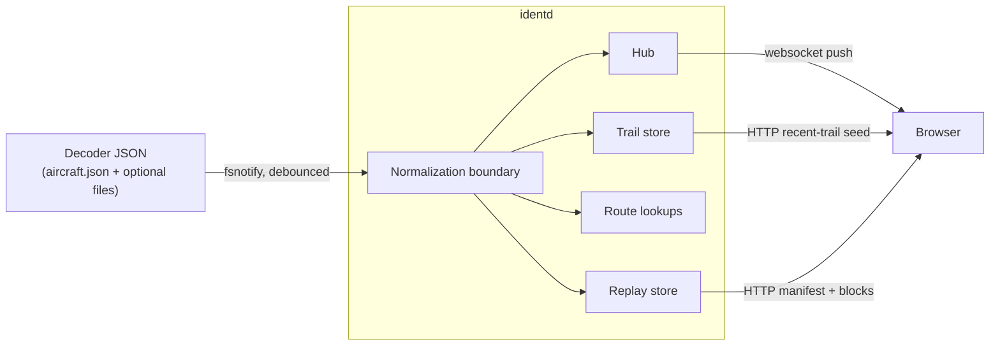
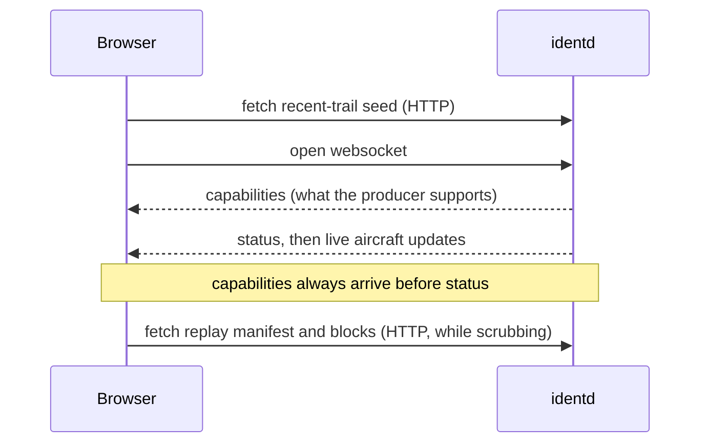

# System architecture

Ident is two programs with one data contract between them.

`identd` is a single Go service that runs on, or beside, the receiver host. It
watches the decoder's JSON files, normalizes the differences between decoders at
one boundary, keeps recent aircraft trails in memory, optionally records bounded
replay history, and pushes typed updates to browsers over a websocket.

The web app is a React, Vite, and MapLibre single-page app. It is compiled into
the `identd` binary at build time, so a default install is one process and one
artifact. It renders the map, the traffic list, the aircraft inspector, and the
replay scrubber.

Everything the browser shows comes from `identd`. The browser never reads the
decoder's files and never needs to know where they live on disk. That keeps the
receiver-specific details, including directory layout and file names, on the one
side that has to deal with them.

## Data flow

The decoder writes a small set of JSON files: a live aircraft snapshot it
rewrites roughly once a second, plus optional receiver metadata, stats, and a
range outline. `identd` watches those files with filesystem notifications
([fsnotify](https://github.com/fsnotify/fsnotify)), debounces a burst of writes
into one update, and turns each change into work.

Receiver data goes through one normalization boundary first, where the decoder's
dialect is translated into Ident's own types. From there the live aircraft
snapshot fans out to several independent consumers: the trail store, the replay
store when it is enabled, route lookups for the callsigns in the frame, and the
hub that pushes updates to browsers. Each consumer reads the same normalized
frame and none of them depends on the others.

The browser holds a websocket to the hub for the live picture and fetches a few
supporting documents over plain HTTP: a seed of recent trails when it first
loads, and the replay manifest and finalized replay blocks when an operator is
scrubbing history.

## Startup order

`identd` does not assume it knows which decoder it is reading. It watches the
receiver metadata file first and waits to classify the producer from it before
starting the aircraft, stats, and outline watchers. Running those watchers
before classification would emit a warning on every file change while the type
is still unknown, so they are held back until there is an answer.

The HTTP server starts before that gate, so the web app is reachable while the
receiver file is still missing or malformed. A waiting receiver shows the UI and
a diagnostic rather than a dead page, and the service log notes that it is still
waiting at a steady interval so a long wait stays visible.

## Why this shape

A few decisions set the overall structure. The subsystem pages expand on each.

Normalization happens once, in the backend. Decoder dialects differ in field
names, units, and meaning. Rather than teach the frontend several dialects,
`identd` translates everything into Ident's own types at a single adapter layer,
so the wire contract is the project's own and not any one decoder's. See
[Producer normalization](/backend/producer-normalization).

The live picture is pushed, not polled. `identd` holds current state in memory
and pushes it over a websocket. This is a starting point, chosen for its
simplicity on a single small host, rather than a migration away from serving
chunked files. See [Live transport](/backend/live-transport).

Trails and replay are separate systems that happen to read the same feed. Trails
are an in-memory view of the recent past for the live map; replay is an opt-in,
on-disk record meant for looking back in time. Changing one does not affect the
other. See [Aircraft trails](/backend/trails) and [Replay history](/backend/replay).

Failures are surfaced rather than swallowed. A TTL-backed diagnostics store turns
transient and ongoing problems into a small set of de-duplicated notifications,
shown in a bell in the status bar, instead of a log nobody reads. See
[Diagnostics](/backend/diagnostics).

Much of the stack is biased toward low-end hardware. Many receivers run on a
single-board computer with a flash card, so several choices reduce IO and write
wear at some cost to accuracy or completeness. That bias is most visible in
trails, replay, and deployment.

## The subsystem pages

The backend pages cover what `identd` does with receiver data:

- [Producer normalization](/backend/producer-normalization): the one boundary
  where decoder dialects become Ident types.
- [Live transport](/backend/live-transport): the websocket hub and the typed
  updates it pushes.
- [Aircraft trails](/backend/trails): the in-memory recent paths and how they
  survive a restart.
- [Replay history](/backend/replay): the opt-in, bounded on-disk record.
- [Diagnostics](/backend/diagnostics): how problems become notifications.

The frontend pages cover what the browser does with that data:

- [Map and rendering](/frontend/map-rendering): the custom MapLibre layers and
  day and night theming.
- [Trails and replay playback](/frontend/trails-replay): rebuilding trails while
  scrubbing recorded history.

The operations pages cover running it:

- [Deployment](/operations/deployment): install shapes, and serving replay
  blocks through a reverse proxy on busy displays.
- [Security](/operations/security): Ident has no built-in authentication and
  treats receiver data as read-only, so it is meant for a private network or an
  operator's own reverse proxy.
