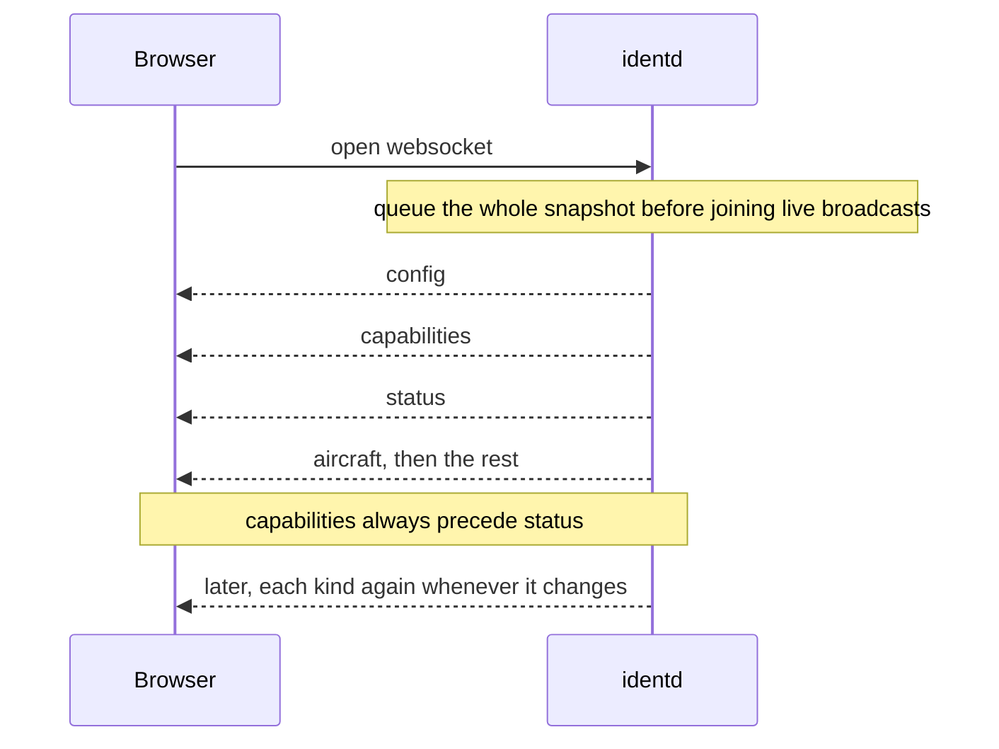

# Live transport

`identd` holds the current state of the receiver in memory and pushes it to
browsers over a single long-lived websocket. A connecting browser receives the
current state right away and then receives a fresh copy whenever it changes.

## Snapshots, pushed

The data-flow direction sets the shape here. `identd` is the one that knows when
something changes, and clients only need to show the latest state, so it pushes to
them over a websocket rather than having them ask.

The state is held as snapshots, not as a stream of incremental edits. For each
kind of update the server keeps the latest snapshot and overwrites it when a newer
one is produced. A connecting client is replayed the current snapshot of each kind,
so it starts fully up to date, and then receives each new snapshot as it is made.
Because every message is a complete snapshot rather than a delta, a client never
has to reconcile a stream of changes against an earlier baseline, and a
reconnecting client re-syncs just by receiving the current snapshots again. There
is no backlog of missed updates to replay.

A client that drops offline reconnects on its own, with backoff and jitter so a
server restart does not cause a thundering reconnect.

The same direction fits every kind of update, not just the live aircraft frame,
and that is where a pushed connection earns its keep. Capabilities change only
when the producer's state does, configuration changes rarely, and diagnostics
appear only when a condition arises. Polling each of these on a timer would mean
clients repeatedly asking about things that almost never change, and still
hearing about them late. A connection the server can write to lets it send each
kind exactly when it changes, once, to every client. There is no reason a client
should poll for its capabilities.

One socket carries every kind of update rather than one per kind. That keeps a
single handshake and a single reconnect path, and it lets the server control the
order of the different kinds of update on one connection. That ordering matters
for the capabilities-before-status rule below.

## Messages are versioned envelopes

Each message on the socket is a small envelope: a tag that says which kind of
update it is, wrapped around a payload that carries its own schema version. The
tag lets the browser route the message without parsing the payload, and the
version lets payloads change shape over time without a client guessing which
shape it is looking at. The server builds the envelope around payload bytes it
already has rather than re-serializing them, so relaying an update stays cheap.

The kinds of update are a small fixed set: runtime configuration sent once,
receiver capabilities, hot receiver status, the live aircraft frame, the range
outline, replay availability, operational diagnostics, route lookups, and trail
deltas. Most of these are described on their own pages; the parts specific to the
transport are how they are ordered on connect and how a few of them deviate from
the simple "latest value" model.

## Snapshot on connect, in a fixed order

When a browser connects, the server gathers the latest value of each update kind
and queues that whole snapshot into the new client's send buffer before the
client is added to the set that receives live broadcasts. A live change cannot
slip in ahead of the snapshot, because nothing is broadcast to the client until
the snapshot is already queued. The send buffer for a new client is sized to hold
the full snapshot plus a little headroom, so a burst of live activity during
connect does not overflow it.

The snapshot is emitted in a fixed order, and that order is deliberate:
capabilities always precede status. Status describes hot measurements whose
meaning depends on what the receiver can report, such as whether a given figure
comes from the producer directly or is derived by `identd`. Capabilities
carry that description. If status arrived first, a client would have to either
hold it aside or interpret its fields against a description it had not received
yet. Fixing the order at the point where snapshots are emitted removes that race
without any per-message bookkeeping. The declared order is the only place the
rule lives.

## Capabilities apart from status

Capabilities and status are split onto separate messages on purpose. Capabilities
say what the receiver can provide and where each figure comes from; they change
rarely, on connect, when the producer is reclassified, or when a field that was
absent first shows up in live data. Status carries the fast-moving measurements
and is emitted every time the receiver's data changes, which is well under a
minute apart.

Folding the capability description into every status message was the alternative.
It would have meant repeating slowly-changing facts on the hottest path on the
wire and making the browser re-evaluate them on every tick. Keeping them separate
means capabilities are sent when they actually change, plus once on connect ahead
of status, and the browser can cache them and only re-read on reconnect.

Each capabilities message is the full current set rather than a description of
what changed since last time. Because connect always delivers a current set first
and the set rarely changes afterward, sending the whole thing costs little, and
the browser can replace its copy wholesale instead of merging deltas. Tracking
per-field revisions on the server would add machinery for no real gain.

## Updates that are not a single latest value

Two kinds of update do not fit the "keep the latest value and replay it on
connect" model.

Route lookups accumulate as `identd` resolves the origin and destination for
callsigns it sees. Rather than a single value, the current state is the whole set
of known routes, so on connect the server sends one message holding every known
route, and after that each newly resolved or expired route arrives on its own.
`identd` only queries the upstream route service while at least one browser is
connected, since there is no reason to build a route cache for an empty audience,
and queued lookups wait until a client arrives.

Trail history does not travel over the socket at all on connect. The recent path
of every aircraft can be several megabytes for a busy receiver, and pushing that
through the per-client snapshot buffer would size that buffer unpredictably and
hold up the other snapshot messages behind it. Instead the browser fetches the
trail history once over a plain HTTP endpoint at page load, in parallel with
receiving the socket snapshot, and then receives new trail points as live deltas
over the socket like everything else. [Aircraft trails](/backend/trails) covers
what those points hold and how they are kept.

## Connection lifecycle

The socket is reached at a fixed endpoint under the API path. The server pings
idle connections on an interval and drops a connection whose peer has gone silent
past a read deadline. A client that cannot keep up, one whose send buffer fills
because it is not draining fast enough, is dropped rather than allowed to slow
delivery to everyone else, so one stalled browser does not back up the others.
The frontend treats a dropped connection as normal and reconnects with
exponential backoff and jitter.
