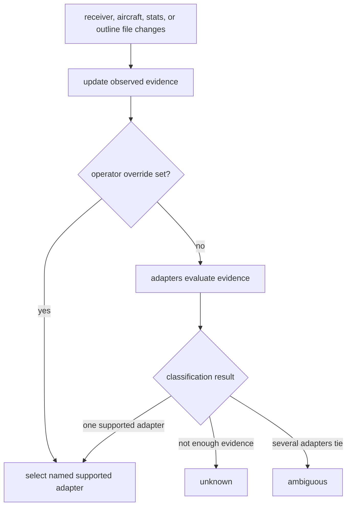

# Producer normalization

ADS-B decoders write a handful of JSON files to disk: a live aircraft snapshot,
a receiver description, a statistics file, and a range outline. `identd` watches
these files and republishes them over its websocket hub as Ident-owned types.
The supported decoders (readsb, dump1090-fa, and the dump978/skyaware978 UAT
decoder) overlap in what they write but disagree on field names, units, and
which files they emit at all. All of that dialect knowledge lives in one place
in `identd`, behind a small per-decoder adapter. The frontend never sees raw
decoder JSON.

## Why the differences are absorbed in one place

The alternative would be to forward decoder JSON more or less untouched and let
the frontend branch on which decoder is running. That spreads dialect knowledge
across the whole system: a schema change, a unit quirk, or a newly supported
decoder would mean edits in both the backend and the frontend, and the frontend
would carry conditional logic for decoders a given operator will never run.
Folding the differences into `identd` keeps the frontend contract fixed
regardless of what sits underneath, at the cost of a translation layer that has
to be kept honest against each decoder's actual output.

## The adapter shape

Each decoder is represented by an adapter that knows how to do a few things:
recognize its own decoder from the files that have arrived, describe which
pieces of operational data that decoder actually provides, and translate each
of the four files into Ident types. An adapter that cannot supply a given file
says so rather than guessing; the UAT decoder, for instance, emits no
statistics file and no range outline, and its adapter reports both as absent.

The receiver file translates into a small record holding the decoder name, a
version string, and the receiver's coordinates when present. The statistics
file becomes a message rate, a gain figure, an uptime, and a maximum observed
range, each tagged with whether the value came from the decoder or was derived
by Ident. The aircraft file becomes a list of normalized aircraft. The outline
file becomes a polygon.

## How a decoder is identified

Identification is content-based, not path-based. Operators can mount a decoder's
output wherever they like, and some stacks write receiver metadata that is too
generic to identify the stack by itself. `identd` therefore considers the
receiver, aircraft, statistics, and outline files together as evidence for the
adapter selection.

Receiver metadata still carries the strongest signals when it includes an
explicit decoder marker. When it does not, the shape of the statistics and
aircraft files can still be enough to identify a supported decoder. This is
deliberately a "what can this adapter safely normalize?" decision rather than a
"what product name is this directory?" decision. The result is one of four
states:

- An operator override names a supported decoder, so that adapter is selected.
- Exactly one adapter has enough evidence, so that adapter is selected.
- No adapter has enough evidence, so the producer remains unknown.
- More than one adapter has equally strong evidence, so `identd` reports an
  ambiguous producer. If no adapter has been selected yet, producer data waits
  until more evidence arrives or an override is set. If the currently selected
  adapter is still one of the tied candidates, `identd` keeps that adapter for
  normalization and treats the tie as a diagnostic rather than a reason to
  demote the stream.

Unknown and ambiguous states are surfaced as diagnostics, including the
strongest evidence `identd` has seen so far. That keeps an unsupported or
unusual stack visible to the operator without guessing a decoder. Once a decoder
has already been selected, later ambiguous evidence only blocks a switch away
from that decoder unless the operator overrides it or stronger evidence appears.

A decoder that no adapter recognizes stays unknown. Some decoders write
aircraft JSON that Ident could in principle read but are simply not recognized
by any adapter and so never get classified. Others are structurally
incompatible: a decoder whose aircraft file is a bare array, without the
surrounding frame fields Ident expects, would be rejected during translation
even if it were somehow classified. These are different situations, but from the
operator's point of view both end the same way, with no decoder-shaped data
published.

## Forcing a decoder, and catching the disagreement

An operator can override automatic identification and name the decoder
explicitly through an environment variable or its matching command-line flag,
with a few accepted spellings per decoder. The override selects the adapter, but
automatic identification still evaluates the observed files. When the observed
evidence points at a different decoder, `identd` emits a diagnostic rather than
quietly trusting the override, so a misconfiguration is visible instead of
hidden. If the named decoder is one this build does not support, that is
reported too.

## Nothing is published before selection

`identd` starts all producer-file watchers during startup so each file can add
evidence as soon as it appears. When no adapter has been selected yet, unknown
or ambiguous producer files are parsed only far enough to help identify a
supported adapter. They are not published as normalized aircraft, status, or
range data until one adapter can safely handle them.

That distinction matters for compatibility. An unknown decoder may write
aircraft JSON that looks close to a supported shape, but publishing it before an
adapter is selected would let raw decoder semantics leak into Ident's wire
contract. The HTTP server still starts immediately, so the interface stays
reachable while classification is waiting for enough evidence, and the
diagnostic bell explains why live producer data is not flowing yet.

## Where the decoders actually differ

Most of the aircraft translation is shared across decoders. The visible
per-decoder differences are in how the statistics file becomes a status, and
they are mostly about units and which field to trust.

readsb's message rate comes from a count it labels as valid messages over its
recent window. That label means the message decoded to a plausible result, not
that it passed a strict integrity check, so the rate should be read as
"plausibly valid traffic" rather than a clean-signal guarantee. readsb reports
maximum range in meters; the adapter converts to nautical miles before putting
it on the wire, and the conversion matters, because treating the figure as kilometers
would be wrong by roughly two orders of magnitude. Uptime is the gap between the
file's current timestamp and the start of its all-time window.

dump1090-fa takes its message rate from a plain message count rather than a
validity-filtered one, and its window boundaries are floating-point seconds, not
milliseconds; a decoder that assumed milliseconds would compute an interval a
thousand times too short. Its uptime is measured from the end of the recent
window back to the start of the all-time window. It writes no range outline.

The UAT decoder writes no statistics file at all, so its adapter produces no
status from one, and it marks gain and uptime as unavailable rather than
implying they exist.

## What a normalized aircraft looks like

A normalized aircraft frame carries one entry per aircraft the decoder currently
sees. The fields are an effective union across the supported decoders: a field
that any one decoder can supply has a place in the Ident type, and frames simply
omit the fields a given aircraft or decoder does not provide.

Field names carry their units, so a reader does not have to remember which
decoder measures a given quantity in which unit. The aircraft address is always
present and lowercased, and a separate classification of the address records
whether it looks like a standard ICAO address, a non-ICAO address, or something
unrecognized. The decoder's notion of how a track was acquired is mapped onto a
closed set of values; an acquisition type Ident does not know about becomes
"unknown" rather than leaking the raw decoder string onto the wire. No raw
decoder fields are forwarded untranslated.

Ground state gets special handling because decoders express it in more than one
way. A frame may carry an explicit ground flag, an altitude field whose value is
the literal text "ground", or a separate air/ground field that may be a word or
a number. The adapter folds these into a single on-ground value, preferring the
explicit flag, then the altitude sentinel, then the air/ground field. Barometric
altitude is reported only as a number; when the decoder signals ground through
the altitude field, the altitude is treated as absent rather than as a height.
This single on-ground value is what trail segmentation reads (see
[Aircraft trails](/backend/trails)).

## What each decoder can do

Alongside the status and aircraft data, `identd` publishes a description of which
features a decoder supports. Each feature is marked as provided by the decoder,
derived by Ident, or unavailable. The selected adapter sets a conservative
baseline from the evidence it has seen, and live data can promote a feature as
statistics, aircraft frames, or outline files confirm it is actually present.
Promotion is one-directional within a single selected decoder: a later file
update does not demote a feature that earlier live data already established, so
the interface does not flicker a capability off and on as files arrive in
different orders. A demotion happens only on a real change of circumstance, such
as the decoder itself changing or the producer becoming ambiguous again.
