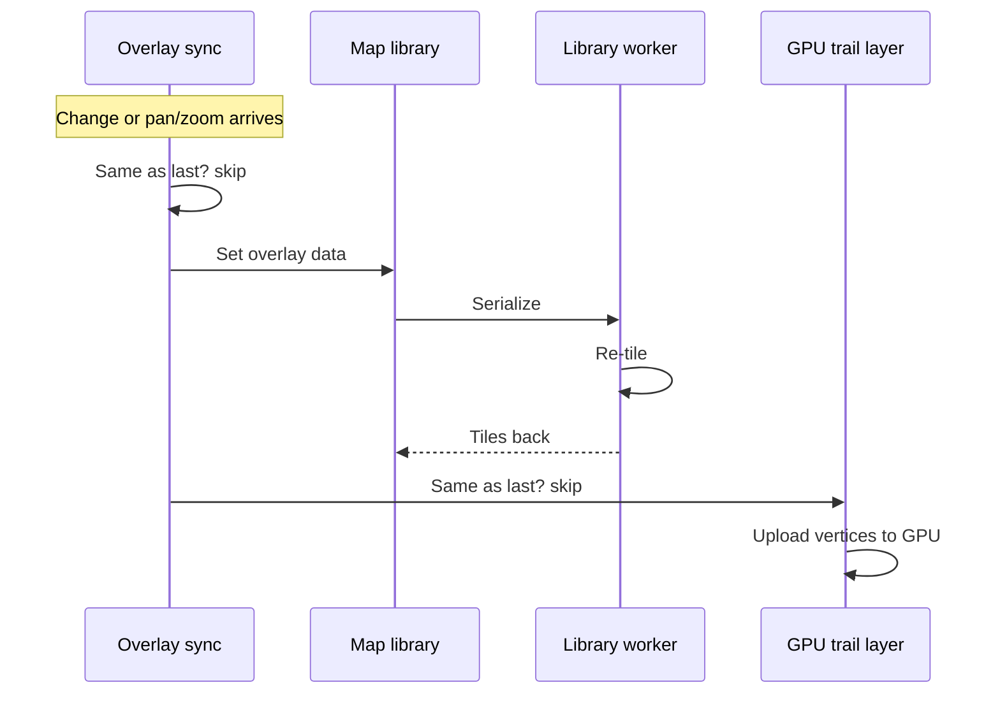

# Map and rendering

Ident draws aircraft, trails, and range overlays on a vector map. The map
library is loaded at runtime rather than bundled into the application, so the
initial download stays small on low-end hardware. The rest of the frontend talks
to it through a single boundary that exposes the library's types at build time.

The work is split in two. One piece owns the map instance: it creates the map
once, swaps the basemap style when the basemap or theme changes, and publishes
the live map handle and a readiness flag to the rest of the app. Everything that
changes often, such as aircraft positions, trails, and range and line-of-sight
overlays, lives separately and consumes that handle. The split keeps the costly one-time
setup away from the high-frequency updates, and it means the map is never torn
down and rebuilt when only the style changes.

## Aircraft icons

Aircraft are drawn as small monochrome shapes that the map library re-colors at
render time by altitude band. Ident stores one neutral mask per icon and lets
the renderer tint it, so a single set of shapes covers every color variant
without keeping a separate image per band. The shapes themselves are produced at
startup from path descriptions rather than shipped as bitmap assets.

Which icon an aircraft gets is a lookup by its type, with a fallback by broad
category and a simple guess when the type is unknown. A plain arrow is used when
the map is in a mode that only needs heading; type-specific silhouettes are used
otherwise.

## Trails through a custom render layer

Trails are the one overlay Ident does not hand to the map library as ordinary
map data. The straightforward path, writing trail coordinates into a standard
data source and asking the library to redraw, routes every update through the
library's background worker: the payload is serialized, sent to the worker, cut
into tiles, and sent back. Trails update once or twice a second across dozens of
aircraft, and that round trip per update produced visible stutter on low-end
hardware.

Instead, Ident draws trails through a custom layer that the map library calls
once per frame. The layer keeps its own buffer of trail geometry on the GPU and
updates it directly on the main thread, skipping the worker and the re-tiling
step. Conceptually it converts each trail's points into the projected
coordinates the GPU needs, packs the line segments (and, for a selected
aircraft, the per-sample dots) into one block of vertex data, and uploads that
block in a single step. Drawing the segments and the dots from the same data
avoids a second pass for the dots.

The tradeoff is that this layer reimplements work the library would otherwise do
for free: projecting coordinates, building line geometry, and managing the GPU
buffer all become Ident's responsibility, and the drawing code is lower-level
than the rest of the map setup. For an overlay that updates this often and holds
this much geometry, taking that on was worth avoiding the worker churn. For the
overlays that change rarely, the standard data-source path is still used.

The two paths diverge after a shared identity check. An overlay update goes to
the map library, whose background worker re-tiles it and hands tiles back; a
trail update skips that and uploads geometry straight to the GPU on the main
thread.

## Skipping redundant updates

The map library fires events constantly while a user pans or zooms. An early
version recomputed overlay geometry inside those event handlers, which produced
a fresh copy of the data on every frame even when nothing about the underlying
aircraft or rings had actually changed. Each fresh copy looked like new data to
the library and triggered the full serialize-and-re-tile cycle, so simply moving
the map around was enough to cause stutter.

The fix is to treat sameness as identity. Overlay geometry is computed once when
its inputs change, not inside the event handlers, so the same unchanged data
keeps the same identity between events. Before handing data to the library, Ident
compares it against what was last handed over for that source; if it is the same
object, the update is skipped. The trail layer does the equivalent check before
re-uploading to the GPU, and the routine that builds trail geometry returns its
previous result unchanged when all of its inputs match, so an unchanged frame
costs no allocation and no upload.

A related rule sits underneath this. After a style swap, it is unsafe to add new
sources or layers until the new style reports itself fully loaded, but updating
data on sources that already exist is always safe. Ident gates only the creation
of sources and layers on that readiness check and leaves updates ungated.
Conflating the two, by blocking updates behind the same check, caused updates to
be dropped intermittently in ways that were hard to reproduce, so the two cases
are kept separate.

## Day and night theming

The map follows the app's theme. The theme setting is three-way: always light,
always dark, or follow the operating system. In the follow-system mode the app
listens for the OS switching between light and dark and reacts to it, so a system
theme change swaps the map to the matching basemap style while the app is
running, without a reload.

The active basemap also drives the colors of everything Ident draws on top of
it. The current style marks the map's container as light or dark, and the label,
ring, and aircraft-icon colors are defined against that marker so they shift to
suit the tile brightness. The overlay code reads those resolved colors when it
syncs, so the icons and labels always match the tiles underneath them rather than
the app theme alone. This matters when a basemap has a fixed tone of its own.

## A note on providers

Ident renders against third-party map tiles and can show external aircraft
photos and route lookups. These are described here by role (tile provider,
photo provider, route provider) because which specific services are used is a
deployment choice, not part of the rendering design.
