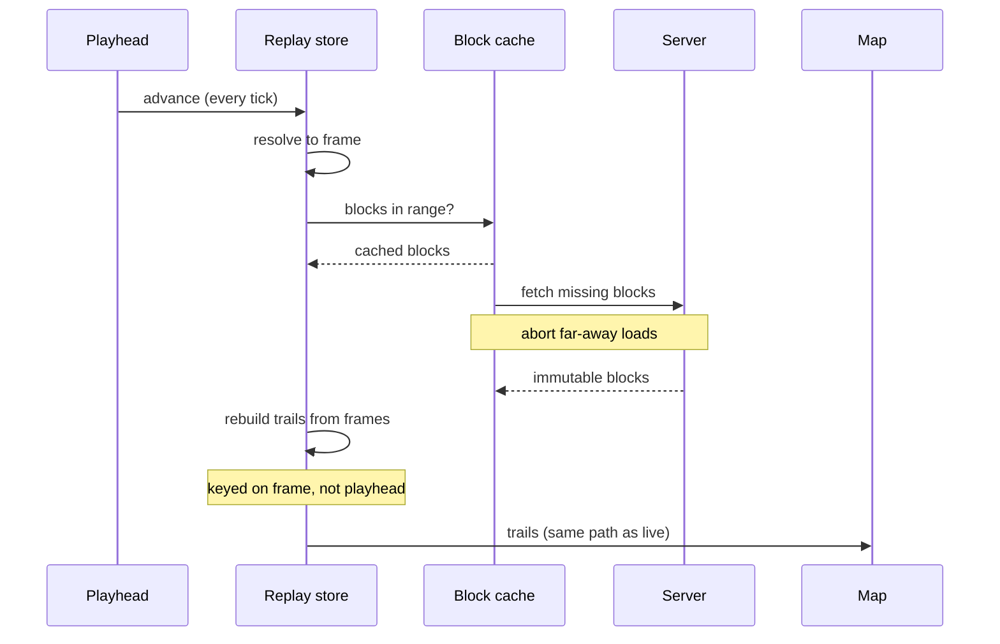

# Trails and replay playback

The frontend draws aircraft trails in two situations: while watching the live
feed, and while scrubbing through recorded [replay](/backend/replay). The two
share a map rendering layer and the same idea of a trail (an ordered run of
positions with timestamps and altitudes), but they get their points from
different places and bound memory in different ways. This page covers how the
browser handles both.

For how trails are kept on the receiver and what a trail point holds, see
[Aircraft trails](/backend/trails).

## Live trail buffering

In live mode the browser keeps a growing buffer of points per aircraft for the
flight leg it is currently watching. There is no fixed cap on the number of
points: the buffer grows for as long as the aircraft stays in view and on the
same leg. The bound on memory is therefore how long an aircraft remains in
range, not a point count, which for a single receiver stays modest even across
all visible traffic.

Two events end a buffer. When the aircraft starts a new leg, detected the same
way the backend detects it from a sustained on-ground stretch, the next point
replaces the buffer with a fresh one rather than extending the old line. This is
a single reset rather than trimming or shifting points out one at a time. And
when an aircraft leaves the receiver's view entirely, its buffer is dropped
whole. The trail-fade setting controls how far back the map draws, but it does
not shorten the buffer; a selected aircraft still has its full current leg
available regardless of the fade window.

## Loading replay blocks

Recorded history is stored as fixed-size compressed blocks. On entering replay
the browser fetches a manifest listing the available blocks and their time
spans, then loads individual blocks on demand as the playhead moves. Blocks are
immutable once written, so they are cached aggressively in the browser; the
manifest itself is fetched without caching so a freshly recorded block becomes
visible.

The block list is held in time order, and the code that finds which blocks
cover a requested range, and that later detects gaps between them, depends on
that ordering. Rather than trust the manifest to arrive sorted, the list is
sorted when it is taken in, so the ordering holds no matter how the backend
emitted it.

Loading is demand-driven around the playhead. A foreground load covers the
frame being shown; a wider background load pulls in nearby blocks so scrubbing
short distances does not stall. Concurrent requests for the same block are
shared rather than duplicated, and in-flight loads for blocks that the playhead
has moved well away from are canceled, so scrubbing back and forth does not pile
up fetches that will land too late to matter.

Block failures are handled differently depending on the cause. Bytes that
arrive but cannot be decoded as a valid block surface an error to the user and
are not retried, because re-fetching the same bad bytes would not help. A
failed or rejected request, by contrast, refreshes the manifest and retries,
since the backend may have rotated the file and a newer manifest can point at a
working URL.

## Reconstructing replay trails

Replay does not store leg ids (see [Aircraft trails](/backend/trails) for why),
so the browser rebuilds trails from the loaded blocks while scrubbing, grouping
points by continuity in the recorded data.

Recorded frames are spaced a few seconds apart, but the playhead moves
continuously and updates on every animation frame during playback or a drag.
Reconstructing the trail on every one of those updates would be wasteful, since
most of them resolve to the same recorded frame. Instead the result is
remembered against the resolved frame time, so it is recomputed only when the
playhead crosses into a new frame rather than on every tick. The cache also
tracks the loaded blocks and the current selection, so it refreshes when new
data arrives or the selected aircraft changes.

The flow from a moving playhead to drawn trails, with the memoization that keeps
the rebuild off the per-tick path:

Trail fade is measured against that same frame time, not against the wall
clock. The icons on the map are drawn from a recorded frame, so measuring how
old the trail's points are from the same frame keeps the tail and the icon in
agreement about what counts as recent. If the two used different clocks, a
replayed icon and its trail could disagree about where the trail should fade
out.

Selected and unselected aircraft get different trail treatment, on purpose.
A selected aircraft is shown with as much history as the loaded blocks hold,
walking back to the earliest point available and crossing block boundaries and
time gaps, since someone who clicked an aircraft usually wants its full path. An
unselected aircraft is shown only a recent window, cut at the most recent break
in its data so a single unbroken stretch is drawn, and capped in length. This
keeps a crowded map from filling with long historical lines from contacts that
have since dropped out.

## The scrubber

The scrubber is a slider whose thumb tracks the playhead. There is a subtle
interaction between dragging it and background block loads: when a load
completes it updates shared state, which re-renders the scrubber, and a slider
driven directly from that state would have its thumb snapped back to the last
committed position mid-drag. To avoid this, the slider is driven from state only
while idle; during an active drag it is left to move on its own and the state is
not pushed back into it until the drag ends. The position is committed when the
drag finishes.

## Following the live edge

Whether playback is treated as "following live" (sitting at the present moment
rather than at a fixed point in the past) is decided in one place and reused by
both the display and the data-loading logic, so the two cannot disagree about
which mode the user is in. It treats playback as following live when the
playhead is at (or effectively at) the latest available time, or when the user
has explicitly asked to follow live.

It also excludes any view pinned to a fixed end time in the past. Without that
exclusion, dragging to the right edge of a fixed historical window would look
like reaching the present and would jump back to live, even though the user
deliberately framed a past slice. The shared rule keeps that from happening.
